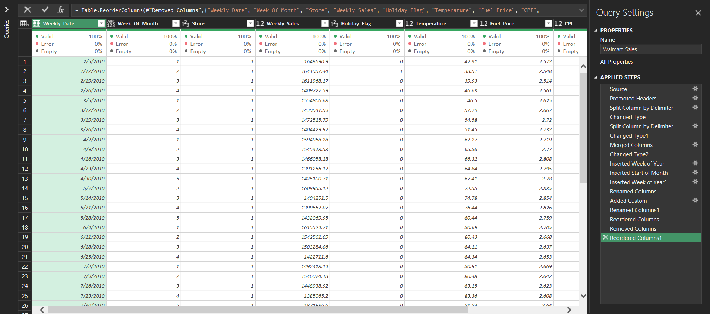
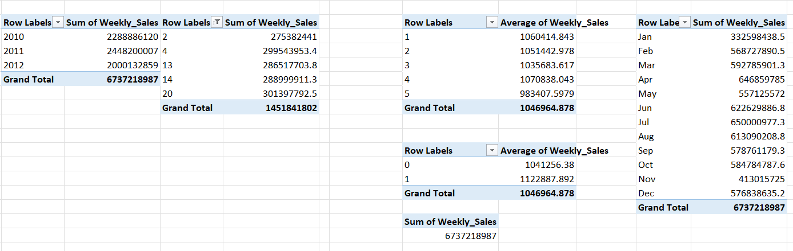
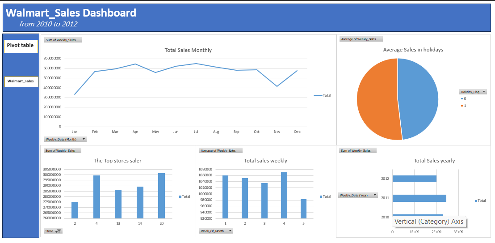

# 🏢 Walmart Sales Analysis

## 📌 Overview
This is my **first hands-on data analysis project**, where I analyzed Walmart sales data (2010–2012) to gain practical experience in data cleaning, exploratory data analysis (EDA), and dashboard creation using Excel.

The project focuses on uncovering sales trends, seasonal patterns, and store-level performance insights.

---

## 🧹 Data Cleaning (Power Query)

- Cleaned and transformed raw data using Power Query  
- Standardized columns and data types  
- Extracted time-based features (Week, Month, Year)  
- Prepared dataset for analysis  

---

## 📊 Pivot Tables & Analysis

- Yearly sales comparison (2010–2012)  
- Monthly sales trends  
- Weekly sales breakdown  
- Holiday vs non-holiday performance  
- Store-level performance insights  

---

## 📈 Dashboard

- Monthly sales trends visualization  
- Average sales during holidays vs normal days  
- Top-performing stores  
- Weekly and yearly sales comparison  

---

## 📊 Key Insights
- Sales peaked during mid-year months (June–July)  
- Holiday periods showed noticeable impact on average sales  
- Certain stores consistently outperformed others  
- Sales trends vary across weeks and seasons  

---

## 🛠️ Tools Used
- Microsoft Excel  
- Power Query  
- Pivot Tables  
- Data Visualization  

---

## 🚀 Outcome
Completed my first data analysis project, transforming raw data into actionable insights and building an interactive dashboard to support data-driven decision-making.
